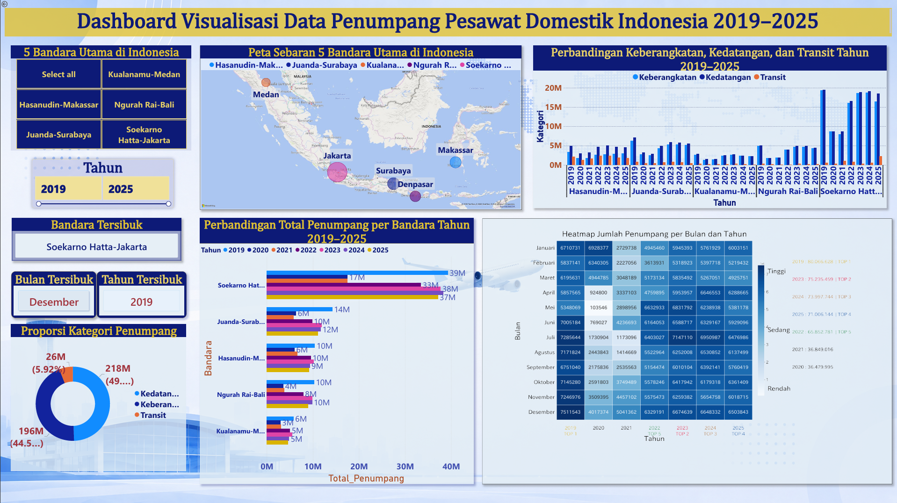

# Indonesian Domestic Air Passenger Dashboard

An end-to-end data analytics project that analyzes domestic air passenger data across five major airports in Indonesia from **2019 to 2025**, covering the categories of **departures, arrivals, and transit passengers**.

The project includes data preprocessing using **Python and Pandas**, followed by data visualization and dashboard development using **Microsoft Power BI**.

---

## Dashboard Preview



---

## Project Overview

This project was developed to transform domestic air passenger data into an interactive and informative dashboard that makes it easier to observe passenger trends and compare activity across major airports in Indonesia.

The analysis focuses on five major airports:

- Soekarno Hatta – Jakarta
- Juanda – Surabaya
- Ngurah Rai – Bali
- Hasanuddin – Makassar
- Kualanamu – Medan

The dataset covers the period from **2019–2025** and includes three passenger categories: **departure, arrival, and transit**.

---

## Tools & Technologies

- **Python** — data preprocessing and transformation
- **Pandas** — data cleaning, integration, and restructuring
- **Google Colab** — Python development environment
- **Microsoft Power BI** — data visualization and dashboard development
- **DAX** — calculations and dashboard measures

---

## Data Processing Workflow

The datasets from each year were processed and integrated before being imported into Power BI.

```text
Raw BPS Data (2019–2025)
        ↓
Data Cleaning
        ↓
Data Transformation
        ↓
Dataset Integration
        ↓
Final Processed Dataset
        ↓
Power BI
        ↓
Interactive Dashboard
```

The preprocessing process includes restructuring the original datasets, standardizing the data format, selecting the five airports used in the analysis, combining data from 2019–2025, and transforming the dataset into a format suitable for visualization.

The complete preprocessing notebook is available in the [`notebooks`](./notebooks) folder.

---

## 📈 Dashboard Features

The dashboard provides several analytical views, including:

- Passenger comparison across five major airports
- Passenger trends from 2019–2025
- Comparison of departures, arrivals, and transit passengers
- Passenger distribution by airport location
- Monthly and yearly passenger heatmap
- Identification of the busiest airport, month, and year
- Interactive filters for airport and year selection

---

## 📁 Repository Structure

```text
indonesia-air-passenger-dashboard/
│
├── dashboard/
│   └── Power BI dashboard (.pbix)
│
├── data/
│   ├── raw/
│   │   └── Raw datasets (2019–2025)
│   └── processed/
│       └── Final dataset for Power BI
│
├── images/
│   └── dashboard-preview.png
│
├── notebooks/
│   └── PI_SS.ipynb
│
└── README.md
```

---

## Data Source

The data used in this project was obtained from **Badan Pusat Statistik (BPS)** and contains domestic air passenger statistics for five major airports in Indonesia.

---

## Dashboard Access

The original interactive dashboard was developed using Microsoft Power BI. Public web access is not available due to organizational Power BI publishing restrictions.

The dashboard preview is provided above, while the `.pbix` project file is available in the [`dashboard`](./dashboard) folder for further exploration.

---

## 👤 Author

**Anggia Rahmani Syahdianto**  
Information Systems - Universitas Gunadarma
